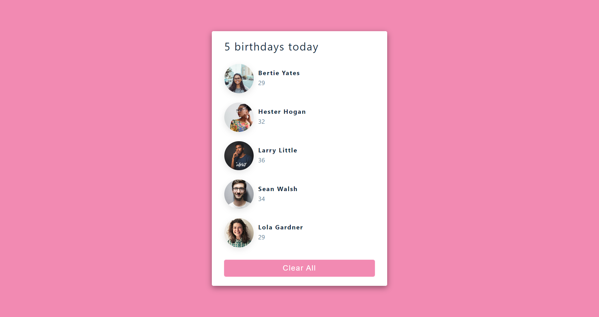

# Birthday-reminder

## Table of Contents
* [Overview](#overview)
* [Project Screenshot](#screenshots)
* [Installation](#installation)
* [Reflection](#reflection)
* [References](#references)
* [Author](#author)

# Overview
A simple application to remind you about birthday of your friend and family.

## Screenshots
 

### You can watch Live demo [_here_](https://superb-parfait-affd52.netlify.app/).

## Installation

Clone down this repository. You will need `node` and `npm` installed globally on your machine.  

Installation:

`npm install`  

To Start Server:

`npm start`  

To Visit App:

`localhost:3000`  

## Reflection

I learned to traverse array of object, which helped me to create one component and reuse it multiple times. I overcame key props error while traversing throughout array of object.

The technologies implemented in this project are React and TailwindCSS. I chose to use the `create-react-app` boilerplate to minimize initial setup and invest more time in diving into weird technological rabbit holes. 

## References
- [TailwindCSS](https://tailwindcss.com/)
- [React](https://reactjs.org/docs/getting-started.html)
- [UI Design](https://uidesigndaily.com/posts/sketch-birthdays-list-card-widget-day-1042)

## Author

[Website](https://kedarmakode.com/)

[Linkedin](https://www.linkedin.com/in/kedar-makode-9833321ab)

[Twitter](https://twitter.com/Kedar__98)

[Instagram]()

kedarmakode1598@gmail.com

